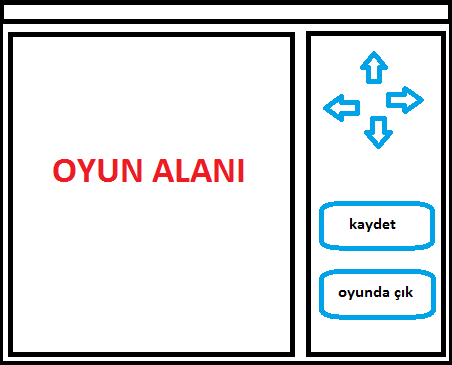

# <Goldman> Oyunu

== Proje Analiz

Bu oyunda, kullanıcı, canavarlar ve hazineleri içeren labirentteki karakteri 
kontrol eder. Oyuncunun minimum hamle yaparak mümkün olduğunca fazla hazine toplaması 
ve labirentten çıkması gerekir.

Toplanan her hazine için oyuncu puan alır. Bir oyuncu bir canavar tarafından 
yenilirse - oyun kazanılan puanla biter. Ayrıca, oyuncunun belirli sayıda adımdan sonra 
labirentten çıkmakamazsa, oyun sona erer.

Oyun tüm kullanıcılar için istatistikler ve en iyi sonuçları içerir.

Bunlar oyunun başlangıç ​​koşullarıdır, gelişim sırasında bazı noktaları eklenecektir.

### Temel kurallar

Tüm oyun, içinde kare hücrelerin bulunduğu bir haritada (oyun alanı) gerçekleşir.

Hücre aşağıdaki nesneleri içerebilir:

* Boşluk
* Duvar (tüm hücreyi doldurur)
* Canavar
* Hazine
* Çıkış

Tüm oyun nesneleri grafik resimlerle temsil edilmelidir.

Karakter, oyuna atanan konumdan başlar. Yukarı, aşağı, sola ve sağa hareket edebilir. 
Ancak çapraz hareket edemez. Ayrıca hareket etmeden durabilir.

Karakter yeni bir hücreye girdiğinde:

* Hücrede bir canavar varsa, karakter ölür, oyun sonlandırılır.
* Hazine - puan ekleme (hazine kaybolur)
* Çıkış - puanlarda %80 artış, oyun sonlandırılır.

Tüm hareketlerin sonunda - çıkışa ulaşılmazsa - karakter ölür.

Oyun aşağıdaki ana menüyü içermelidir:

* Yeni oyun
* Oyunu yükle(kaldığın yerden devam etmek)
* Istatistikler
* Çık

##### Yeni oyun

Oyuncuya isim girmek için bir pencere görüntüler.

İsmi başarıyla girdikten sonra, oyuncuya harita gösterilir ve oyun başlar. Oyun 
sona erene kadar ana menüye erişilemez. Başarısız giriş yapıldıktan sonra - ana menüye döner.

##### Oyunu yükle

Oyuncunun ismini girmesi istenir. Aynı isimde bir kayıt bulunursa, oyun yüklenir. 
Aksi takdirde, bir hata mesajı alır ve ana menüye döner.

##### İstatistik

Tüm oyuncular için bir tablo sütüleri:

* Oyuncu Adı
* Toplanan Puan
* Toplam oyun sayısı
* Başarılı oyun sayısı

Tablo "Toplanan Puan" sütunune göre azalan sırada sıralanmalıdır.

##### Çıkış

Oyundan çık.

##### Yönetim

Karakteri, klavyeden (oklar) veya kontrol düğmelerinden kontrol edilebilir olmalıdır.

== Tasarım

### Use-case Diyagramı

Yukarda bahsedilen temel kuralları dikkete alarak aşagıdaki use-case diyagramı oluşturulmuştur.

image::uml/usecase/image/usecase.png[Use-Case Diyagram]

### Class Diyagramı

image::uml/class/image/class.png[Class Diyagram]

=== Proje Geliştirme aşaması

1. Arayuz geliştirilmiştir
2. Oyun objelerini tanımlayan sınıflar oluşturulmuştur.
3. Harita oluşturulmuştur ve objeler yerleştirilmiştir.
4. GoldMan'ı hareketlendirmek
5. Monster'i hareketlendirmek

=== Low Coupling Prensibi Kullanımı

Bileşenler/objeler arasındaki bağımlılıkları minimal düzeyde tutmak için bileşenlerin 
birbiriyle olan iletişimleri daima arayüzler üzerinden kurgulanmıştır.

=== SOLID Prensiblerinden Single Responsibility Kullanımı

Projede tüm sınıflar Tek Sorumluluk Prensibine uygun tasarlanmıştır. Örnek vermek gerekirse,
FSGameMap sınıfı sadece file system'den harita bilgisini yukleme işlemini yapmaktadır. 
DSGameMap de aynı şekilde veriabanından harita bilgilerini okuma/yukleme işlemini yapmaktadır.
Yani bu iki sınıf haritayı görüntüleme işine karışmamaktadır. Yuklenen haritayı kullanıcıya
goruntuleme işini JTableGameMap sınıfı yapmaktadır.

=== Yaratımsal Tasarım Deseni Kullanımı

Projenin başlangıcında sunum/gui bileşeni Swing ile gerçekleştirilmiştir. Daha sonra 
analiz aşamasında belirtilen nesnelere ait sınıflar oluşturulmuştur. 

Oyun nesnelerini oluşturuken **Fabrika** tasarım deseni kullanılmıştır(GameObjectCreator sınıfı).

.Neden Fabrika tasarım deseni kullanılmıştır?
 Belirli bir nesne türüne bağlanma yok
 Soyutlama seviyesini oluşturmak için
 Nesnelerin belirli davranısları alt sınıflarda belirlenmesi
 
Burada __Factory__ konumundaki sınıf GameObjectCreator'dur, __Product__ arayuzu karsiliginda 
AbstractGameObject sınıfı gelmektedir. __Concrete__ urunler ise Exit, GoldMan, Monster, Nothing, 
Treasure ve Wall sınıfları yer almaktadır. Client sınıfı da FSGameMap veya DBGameMap sınıflarıdır.

GameObjectCreator sınıfında aynı zamanda **Singleton** tasarım desenide kullanılmıştır.

GameObjectCreator sınıfında olduğu gibi oyun haritasını oluşturmak için de Factory 
tasarım deseni kullanılmıştır(MapCreator). Burada FS veya DB şeklinde dosyadan veya veritabanından
gibi secenekler vardır.

=== Yapısal Tasarım Deseni Kullanımı

Öncelikle Strategy ve State tasarım desenleri Monster hareketleri için uygun olup 
olmadıgı incelenmiştir.

.State tasarım deseni faydaları
 Nesne kendi durumuna bağlı olarak davranışını degistirir
 Çok sayıda if kosulunda kurtulmamıza yardımcı olur
 Belli bir durumda birçok eylem yapabilir
 
.Strategy tasarım deseni faydaları
 Eylemleri gerceklestirmek icin bir cok algoritmadan secme imkanı saglar
 Özel uygulamalara baglı degildir
 Aynı eylemleri farklı uygulama secenegi sunar
 
.Strategy tasarım deseninin State'den farkları
 Nesne referansı tutmaz
 Bir kerelik eylemler(Monster icin dusunecek olursak sadece hareket etmek)
 
Projede Strategy tasarım deseni kullanılmıştır.

image::uml/class/image/strategy.png[Strategy kullanımı]

=== Davranışsal Tasarım Deseni Kullanımı

Harita uzerinde hamle takibi ve bir hamle yapıldıgı zaman yapılacak işlemleri yapabilmek
adına Observer tasarım deseni kullanılmıştır.

image::uml/class/image/observer.png[Observer kullanımı]

