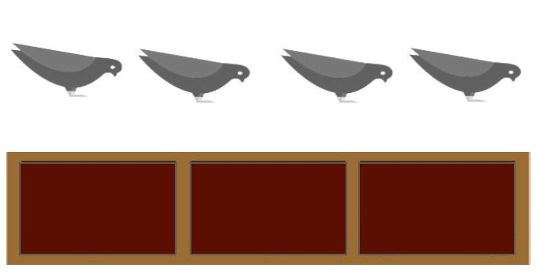

### _Güvercin Yuvası Prensibi_


```math
g,y ∈ Z+
g : güvercin
y : yuva

En az bir yuva ⎡ g/y ⎤ güvercin içerir
```



_**NOT:** `g ≤ y` olması durumunda dahi `⎡ g /y ⎤ = 1` olacaktır._

#### _Yukarı Yuvarlama İşlemi_ `⎡ x ⎤`

Güvercin Yuvası Prensibinde kullanılan yukarı yuvarlama işlemine ait
örnekler aşağıda verilmiştir:

```math
(4.12) = ⎡ 5 ⎤
⎡ 1/2 ⎤ = 1
⎡ 8.0 ⎤ = 8
⎡ 2.9 ⎤ = 3
⎡ -1/2 ⎤ = 0
```

#### _Güvercin Yuvası Örneği_

```math
yuva sayısı = 3
güvercin sayısı = 4
En az bir yuva ⎡ 4/3 ⎤ = 2 güvercin içerir
```

